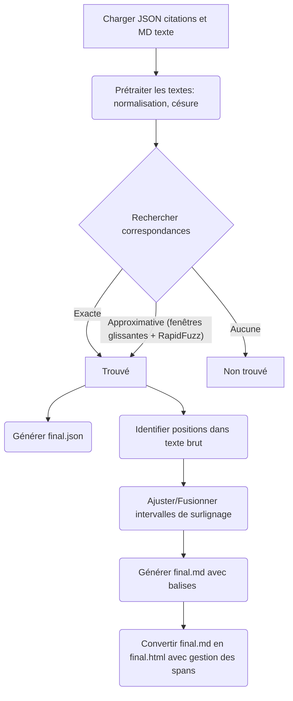

# Text Highlighter

Ce script Python lit des citations depuis un fichier JSON (`quotes_exercice.json`) et un texte principal depuis un fichier Markdown (`input_text_exercice.md`). Il recherche ensuite les occurrences (exactes et approximatives) des citations dans le texte, en tenant compte des variations de formatage, de la césure et de la normalisation du texte.

Les correspondances trouvées sont utilisées pour générer :

1.  `final.json` : Un fichier JSON contenant les citations originales et le texte correspondant trouvé dans le document Markdown prétraité.
2.  `final.md` : Une version du fichier Markdown original où les correspondances trouvées sont surlignées avec des balises `<u>`.
3.  `final.html` : Une version HTML du fichier Markdown surligné, avec une gestion correcte des balises de surlignage (`<span class="quote-highlight">`) même lorsqu'elles chevauchent des blocs de texte (paragraphes, titres).

## Fonctionnement simplifié



## Détail des étapes

1.  **Chargement des données** : Lecture du fichier JSON des citations (`quotes_exercice.json`) et du fichier Markdown du texte source (`input_text_exercice.md`).
2.  **Prétraitement du Markdown** :
    *   Suppression de la césure (mots coupés en fin de ligne).
    *   Conversion en minuscules et suppression des espaces/tabulations multiples (`preprocess_text`).
    *   Normalisation Unicode (`unicodedata.normalize('NFKD', ...)` pour séparer les caractères et leurs accents) et suppression des caractères non alphanumériques (`normalize_for_search`). Cela crée une version `fully_norm_md` simplifiée pour la recherche.
    *   Calcul des correspondances (`difflib.SequenceMatcher`) entre le texte traité (`processed_md`) et le texte complètement normalisé (`fully_norm_md`) pour pouvoir retrouver les positions originales après une recherche sur le texte normalisé.
3.  **Prétraitement des citations** : Application de la même fonction `preprocess_text` (minuscules, espaces) aux citations pour une comparaison plus cohérente.
4.  **Création de segments glissants** : Le texte Markdown prétraité (`processed_md`) est découpé en segments (fenêtres) de `WINDOW_WORDS` mots qui se chevauchent (avançant de `STEP_WORDS` mots à chaque fois). Ceci permet de rechercher des correspondances approximatives dans des portions limitées du texte.
5.  **Recherche des correspondances** : Pour chaque citation :
    *   **Recherche exacte** : La version normalisée de la citation (`normalize_for_search`) est recherchée directement dans le Markdown entièrement normalisé (`fully_norm_md`). Si trouvée, les indices sont remappés vers le texte prétraité (`processed_md`) grâce aux blocs `difflib` calculés à l'étape 2.
    *   **Recherche approximative (si exacte échoue)** :
        *   La citation prétraitée est comparée à chaque segment glissant (étape 4) en utilisant `difflib.SequenceMatcher`.
        *   On calcule un ratio de correspondance basé sur la somme des longueurs des blocs communs (`get_matching_blocks`) rapportée à la longueur de la citation.
        *   Si un segment dépasse un seuil de ratio (ex: 0.75), on calcule le ratio global (`SequenceMatcher.ratio()`) et on conserve le segment ayant le meilleur ratio global.
        *   Le texte correspondant est extrait du meilleur segment trouvé.
6.  **Écriture de `final.json`** : Les résultats (citation originale, texte correspondant trouvé) sont sauvegardés.
7.  **Recherche des positions brutes** :
    *   Le texte Markdown *original* (`raw_md`) est normalisé (`normalize_for_search`).
    *   Les correspondances trouvées à l'étape 5 (et stockées dans `results`) sont normalisées et recherchées dans cette version normalisée du texte brut (`norm_raw`) en utilisant `re.finditer`.
    *   Les positions trouvées dans `norm_raw` sont remappées vers les positions dans le `raw_md` original grâce à de nouveaux blocs `difflib`. Cela donne des positions de départ potentielles (`potential`) dans le texte original.
8.  **Affinage local et collecte des intervalles** :
    *   Pour chaque position potentielle (`rs`) trouvée à l'étape 7 :
        *   On définit une fenêtre locale dans le `raw_md` autour de cette position.
        *   On utilise `rapidfuzz.fuzz.partial_ratio_alignment` pour aligner précisément le texte trouvé (`ft` de l'étape 5) à l'intérieur de cette fenêtre locale du `raw_md`. `rapidfuzz` est efficace pour trouver la meilleure sous-chaîne correspondante même avec des différences.
        *   Si l'alignement est suffisamment bon (score > 85), les indices de début (`fs`) et de fin (`fe`) de la correspondance *dans le `raw_md`* sont extraits de l'alignement.
        *   Ces indices sont ajustés (`adjust_indices_to_word_boundaries`) pour s'assurer qu'ils commencent et finissent à des limites de mots (espaces, ponctuation).
        *   L'intervalle final `(s, e)` est ajouté à une liste `ranges`.
9.  **Fusion des intervalles** : Les intervalles `(s, e)` collectés sont triés. Les intervalles qui se chevauchent ou se touchent *et sont sur la même ligne* sont fusionnés en un seul intervalle plus grand. Cela évite d'avoir plusieurs balises de surlignage collées.
10. **Génération de `final.md`** : Le fichier `raw_md` est reconstruit en insérant les balises `<u>` et `</u>` autour des intervalles fusionnés.
11. **Conversion en `final.html`** :
    *   Le contenu de `final.md` est lu.
    *   Le texte est divisé en blocs (paragraphes, titres) en se basant sur les lignes vides.
    *   Chaque bloc est traité :
        *   Les titres Markdown (`#`, `##`, etc.) sont convertis en balises `<h1>`, `<h2>`, etc.
        *   Les autres blocs sont traités ligne par ligne et encapsulés dans des balises `<p>`.
        *   Pour chaque ligne (ou titre), les balises `<u>` et `</u>` sont remplacées par `<span class="quote-highlight">` et `</span>`.
        *   Un état (`is_span_open_globally`) est maintenu pour gérer correctement les spans qui s'étendent sur plusieurs lignes ou blocs. Si un `<u>` est ouvert mais pas fermé sur une ligne, le span reste ouvert pour la ligne suivante.
    *   Le corps HTML final est assemblé, et quelques nettoyages mineurs sont effectués (ex: suppression des `<p><span ...></span></p>` vides).
    *   Le header HTML est ajouté et le fichier `final.html` est écrit.

## Installation

Assurez-vous d'avoir Python 3 installé. Installez les dépendances nécessaires :

```bash
pip install -r requirements.txt
```

## Utilisation

Placez vos citations dans `quotes_exercice.json` et votre texte dans `input_text_exercice.md`. Puis exécutez le script :

```bash
python highlighter.py
```

Les fichiers de sortie (`final.json`, `final.md`, `final.html`) seront générés dans le même répertoire. 